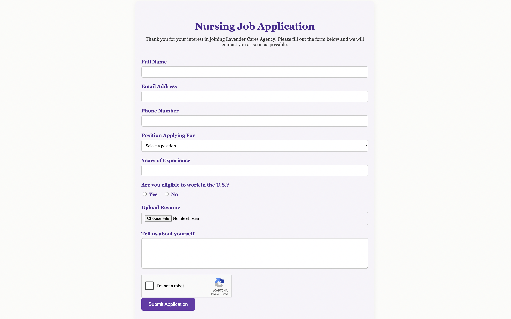

# Lavender Cares Agency Website

This is a full-featured business website I created for a home healthcare agency. It includes:

- reCAPTCHA protection
- Dynamic job and service forms
- Responsive mobile & desktop layout

## ⚙️ Maintenance Update
This is a newly relaunched project (live since June 2025) and is currently undergoing maintenance to refine form functionality and URL structure. Updates are being actively deployed to ensure a seamless user experience.
The site will soon be available (within a few hours to a day). 

> source code is not included to respect client privacy. Screenshots and a video demo are available below.

---

## 📸 Screenshots

| Desktop | Mobile |
|--------|--------|
|  |  |
|  |  |

---

## 🎬 Short Website Demo
[Watch the video](Website-Demo.mov)

## Tech Stack
- HTML/CSS/JavaScript
- PHP
